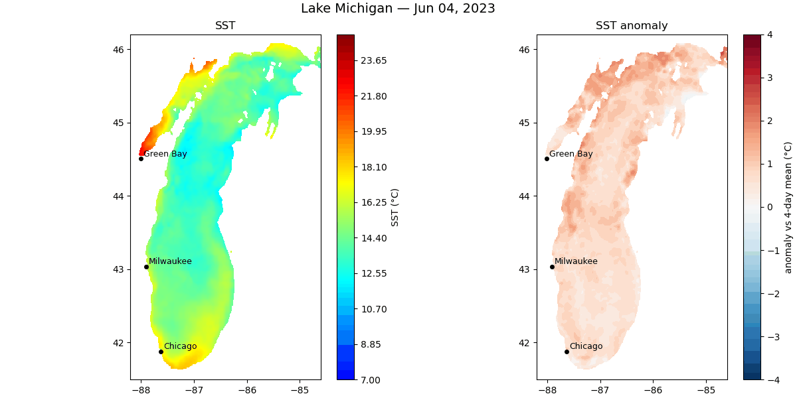

# Great Lakes Environmental Analysis with Python

Python notebooks for downloading, analyzing, and visualizing
environmental observations over the Great Lakes, with an emphasis on
southern Lake Michigan. The notebooks integrate **buoy observations,
satellite remote sensing, Doppler weather radar, and geostationary
satellite imagery** to investigate coastal upwelling, lake breezes,
cloud formation, and other air--lake interactions.

<p align="center">
  
</p>


------------------------------------------------------------------------

# Example Analyses

## Surface Water Temperature and Coastal Upwelling

Use NOAA satellite products to visualize lake surface temperature,
identify upwelling events, and examine temperature anomalies.

<p align="center">
  
</p>


## Wind and Wave Climatology

Analyze historical and real-time NDBC buoy observations using wind
roses, wave statistics, and wind-speed distributions.

<p align="center">
  
</p>


## Doppler Weather Radar

Visualize NEXRAD Level II reflectivity using Py-ART to examine
thunderstorms, lake-breeze boundaries, and other mesoscale weather
features.

<p align="center">
  
</p>

------------------------------------------------------------------------

# Repository Organization

## In-situ observations

### `build_buoy_metadata.ipynb`

Creates a reusable metadata table for southern Lake Michigan NDBC
stations by inspecting historical archives. The resulting CSV identifies
which stations measure wind, water temperature, air temperature, and
solar radiation.

### `buoy_exploration.ipynb`

Explores real-time and historical NDBC buoy observations, including wind
roses, wave climatology, wind-speed distributions, and solar radiation.

------------------------------------------------------------------------

## Satellite observations

### `gl_sst.ipynb`

Downloads and visualizes Great Lakes surface temperature from NOAA
ERDDAP products. Produces SST maps, anomaly maps, and animations for
identifying coastal upwelling events.

### `goes_cloud_animation.ipynb`

Downloads GOES-East ABI imagery and creates configurable animations for
studying lake breezes, cloud development, and other mesoscale weather
phenomena.

------------------------------------------------------------------------

## Radar observations

### `nexrad_pyart.ipynb`

Downloads and visualizes NEXRAD Level II Doppler radar data using the
Python ARM Radar Toolkit (Py-ART). Produces publication-quality
reflectivity maps and animations for severe weather and lake-breeze
studies.

------------------------------------------------------------------------

## Utilities

### `ndbc_io.py`

Reusable functions for downloading and parsing real-time and historical
NDBC buoy observations used throughout the repository.

------------------------------------------------------------------------

# Data Sources

-   **NOAA CoastWatch / GLERL (ERDDAP)** --- Great Lakes surface
    temperature products derived from satellite observations.
-   **NDBC** --- Real-time and historical buoy observations of wind,
    waves, water temperature, air temperature, meteorological variables,
    and solar radiation.
-   **GOES-East ABI** --- Geostationary satellite imagery for studying
    cloud evolution and lake-breeze development.
-   **NEXRAD Level II** --- Doppler weather radar accessed through
    Py-ART.

------------------------------------------------------------------------

# Getting Started

## Installation

### Recommended (conda)

``` bash
conda env create -f environment.yml
conda activate great_lakes
```

### Alternative (pip)

``` bash
pip install -r requirements.txt
```

## Running the notebooks

Open any notebook and execute the cells from top to bottom. Each
notebook contains a configuration section near the beginning where study
dates, geographic domains, and plotting parameters can be modified.

If you are new to the repository, a good progression is:

1.  `buoy_exploration.ipynb`
2.  `gl_sst.ipynb`
3.  `goes_cloud_animation.ipynb`
4.  `nexrad_pyart.ipynb`

before exploring the metadata-building utilities.
